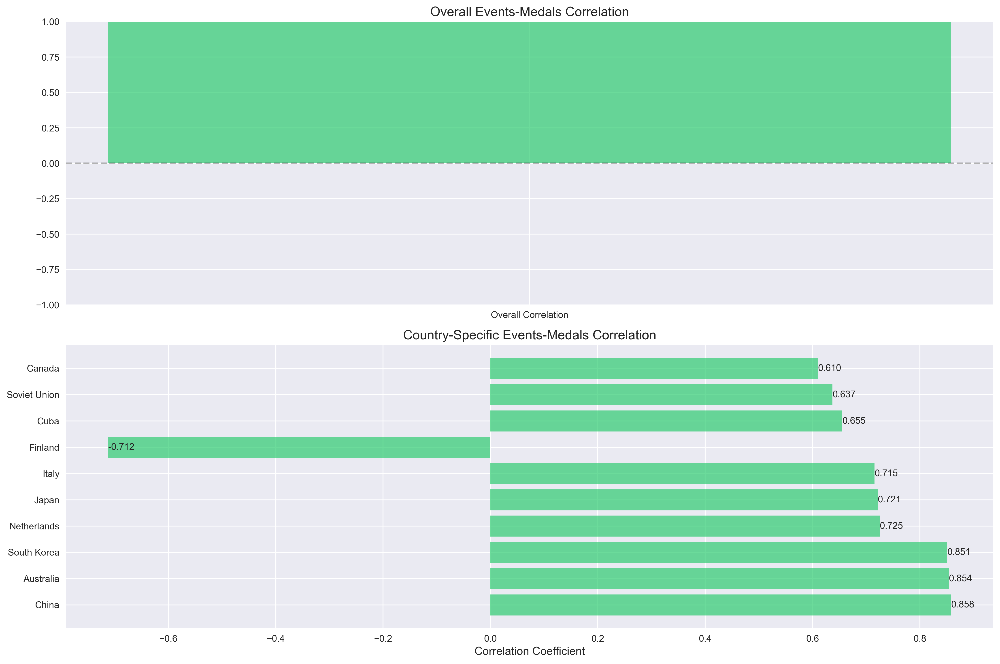

# **2025MCM-C题作答代码部分**

olympic_analysis/
│
├── data/                      # 原始数据和处理后的数据
│   ├── raw/                  # 原始数据文件
│   └── processed/            # 处理后的数据文件
│
├── src/                      # 源代码
│   ├── data/
│   │   ├── __init__.py
│   │   ├── data_loader.py   # 数据加载类
│   │   └── preprocessor.py  # 数据预处理类
│   │
│   ├── features/
│   │   ├── __init__.py
│   │   └── feature_engineer.py  # 特征工程
│   │
│   ├── models/
│   │   ├── __init__.py
│   │   ├── base_models.py   # 基础模型
│   │   ├── ensemble.py      # 集成策略
│   │   └── optimizer.py     # 模型优化
│   │
│   ├── visualization/
│   │   ├── __init__.py
│   │   └── plotter.py       # 可视化工具
│   │
│   └── solutions/           # 针对每个问题的解决方案
│       ├── __init__.py
│       ├── question1.py
│       ├── question2.py
│       └── question3.py
│
├── notebooks/               # Jupyter notebooks做探索性分析
│
├── tests/                  # 单元测试
│
├── requirements.txt        # 项目依赖
└── main.py                # 主运行文件

## essay.pdf为我们的论文部分，
<iframe src="essay.pdf" width="100%" height="500px">
</iframe>

[View PDF](/essay.pdf)

## 结果图片
### 第一题

### 第二题

### 第三题

### 第四题

### 补充

